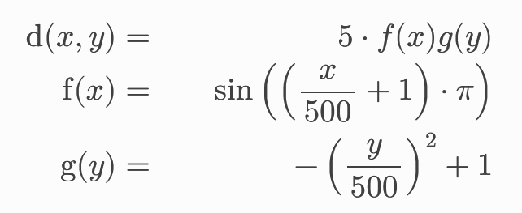

5. Large Data Input and Output
------------------------------

**Project Report 20.5.2026:**

This week our task was to extends our current solver with
bathymetry and vertical displacements of the sea floor.

**1. NetCDF Output**

First we need to improve our file output and change it from ASCII to netCDF.
This will result in a faster file access and remove the overhead caused
by the multiple csv files because we will store all time steps in a single file.

.. code-block:: c++

    void tsunami_lab::io::NetCDF::writeDefs(t_idx i_nx, t_idx i_ny,
                                        t_idx i_stride) {
    nx = i_nx;
    ny = i_ny;
    stride = i_stride;

    nc_try(nc_set_fill(ncid, NC_NOFILL, NULL));

    nc_try(nc_def_dim(ncid, "t", NC_UNLIMITED, &t_dimid));
    nc_try(nc_def_dim(ncid, "y", ny, &y_dimid));
    nc_try(nc_def_dim(ncid, "x", nx, &x_dimid));

    int dimids[3] = {t_dimid, y_dimid, x_dimid};

    nc_try(nc_def_var(ncid, "h", NC_FLOAT, 3, dimids, &h_varid));
    nc_try(nc_def_var(ncid, "hu", NC_FLOAT, 3, dimids, &hu_varid));
    nc_try(nc_def_var(ncid, "hv", NC_FLOAT, 3, dimids, &hv_varid));
    nc_try(nc_def_var(ncid, "b", NC_FLOAT, 2, &dimids[1], &b_varid));
    nc_try(nc_def_var(ncid, "t", NC_FLOAT, 1, dimids, &t_varid));

    nc_try(nc_put_att_text(ncid, h_varid, "units", strlen("meters"), "meters"));
    nc_try(nc_put_att_text(ncid, b_varid, "units", strlen("meters"), "meters"));
    nc_try(nc_put_att_text(ncid, t_varid, "units",
                           strlen("seconds since tsunami event"),
                           "seconds since tsunami event"));

    nc_try(nc_enddef(ncid));
    }

.. code-block:: c++

    void tsunami_lab::io::NetCDF::writeTimeStep(t_real i_simTime, t_real const *i_h,
                                            t_real const *i_hu,
                                            t_real const *i_hv) {
    t_idx l_count[3] = {1, 1, nx};

    for (t_idx l_iy = 0; l_iy < ny; l_iy++) {
        t_idx l_start[3] = {step, l_iy, 0};

        nc_try(nc_put_vara_float(ncid, h_varid, l_start, l_count,
                                 i_h + l_iy * stride));
        nc_try(nc_put_vara_float(ncid, hu_varid, l_start, l_count,
                                 i_hu + l_iy * stride));
        nc_try(nc_put_vara_float(ncid, hv_varid, l_start, l_count,
                                 i_hv + l_iy * stride));
    }

    nc_try(nc_put_var1_float(ncid, t_varid, &step, &i_simTime));

    step++;
    }

**2. NetCDF Input**

Next was the implementation of a new setup for 2D simulations
 which handles data input for the bathymetry and vertical displacements.

First we implemented the ArtificialTsunami setup:

.. code-block:: c++

    tsunami_lab::setups::ArtificialTsunami2d::Displacement(t_real i_x,
                                                        t_real i_y) const {
    return -100 + (std::abs(i_x) <= 500 && std::abs(i_y) <= 500
                       ? 5 * std::sin((i_x / 500 + 1) * M_PI) *
                             (1 - std::pow(i_y / 500, 2))
                       : 0);
    }

Next we added support for reading netCDF files to our netCDF class:

.. code-block:: c++

    void tsunami_lab::io::NetCDF::readDefs() {
    nc_try(nc_inq_dimid(ncid, "x", &x_dimid));
    nc_try(nc_inq_dimid(ncid, "y", &y_dimid));

    nc_try(nc_inq_dimlen(ncid, x_dimid, &nx));
    nc_try(nc_inq_dimlen(ncid, y_dimid, &ny));

    nc_try(nc_inq_varid(ncid, "x", &x_varid));
    nc_try(nc_inq_varid(ncid, "y", &y_varid));
    nc_try(nc_inq_varid(ncid, "z", &z_varid));
    }

.. code-block:: c++

    std::optional<tsunami_lab::t_real>
    tsunami_lab::io::NetCDF::readAt(t_real i_x, t_real i_y) const {
    std::optional<size_t> y = nc_find_index(ncid, y_varid, ny, ys, ye, i_y);
    if (!y.has_value()) {
        return std::nullopt;
    }

    std::optional<size_t> x = nc_find_index(ncid, x_varid, nx, xs, xe, i_x);
    if (!x.has_value()) {
        return std::nullopt;
    }

    size_t index[2] = {y.value(), x.value()};

    t_real val;
    nc_try(nc_get_var1_float(ncid, z_varid, index, &val));
    return val;
    }

Then we implemented the TsunamiEvent2d setup which will be able to handle data input:

.. code-block:: c++

    tsunami_lab::setups::TsunamiEvent2d::getHeight(t_real i_x, t_real i_y) const {
    double b_in = b.readAt(i_x, i_y).value();
    return b_in < 0 ? std::max(-b_in, 20.) : 0;
    }

.. code-block:: c++

    tsunami_lab::setups::TsunamiEvent2d::getBathymetry(t_real i_x,
                                                   t_real i_y) const {
    double b_in = b.readAt(i_x, i_y).value();
    return (b_in < 0 ? std::min(b_in, -20.) : std::max(b_in, 20.)) +
           d.readAt(i_x, i_y).value_or(0.0);
    }

Now we integrate the class into our code so that the user can set the
total simulation time and resolution:

.. code-block:: c++

    if (i_argc < 7) {
        std::cerr << "invalid number of arguments, usage:\n  " << *i_argv
                  << " SIM_TIME CELL_SIZE DOMAIN_START_X "
                     "DOMAIN_START_Y DOMAIN_END_X DOMAIN_END_Y [DISPL.nc "
                     "[BATHY.nc [STATIONS.json [SOLUTION.nc]]]]"
                  << std::endl;
        return EXIT_FAILURE;
    }

Lastly we checked to see if our implementation was correct by comparing our two new setups:

First we have the artificial tsunami setup:

.. video:: graphics/artifical_tsunami.mp4
   :width: 100%

And here we have our artificial tsunami with the netCDF input data:

.. video:: graphics/artifical_tsunami_netcdf.mp4
   :width: 100%

And as we can see they look very similar and our implementation is correct.

**Our contributions**

* Edwin implemented the NetCDF class for input and output and integrated TsunamiEvent2d into our code
* Lara implemented the artificial tsunami and the documentation
