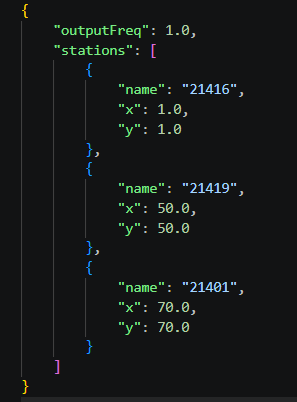

4. Two-Dimensional Solver
-------------------------

**Project Report 6.5.2026:**

This week our task was to extend our one-dimensional discretization to two spatial dimensions.

**1. Unsplit Method**

First we need to find a way to support two dimensional problems in our new class "WavePropagation2d".
We can use the unsplit method which allows us to apply our 
one-dimensional f-wave solver to the shallow water equations in 
two spatial dimensions.
We implemented the time step as such:

.. code-block:: c++

    void tsunami_lab::patches::WavePropagation2d::timeStep(
    t_real i_scaling, solvers::Solver *solver) {
    // pointers to old and new data
    t_real *l_hOld = m_h[m_step];
    t_real *l_huOld = m_hu[m_step];
    t_real *l_hvOld = m_hv[m_step];

    m_step = (m_step + 1) % 2;
    t_real *l_hNew = m_h[m_step];
    t_real *l_huNew = m_hu[m_step];
    t_real *l_hvNew = m_hv[m_step];

    // init new cell quantities
    for (t_idx l_ce = 0; l_ce < m_nCells; l_ce++) {
        l_hNew[l_ce] = l_hOld[l_ce];
        l_huNew[l_ce] = l_huOld[l_ce];
        l_hvNew[l_ce] = l_hvOld[l_ce];
    }

    for (t_idx l_y = 0; l_y < m_nCellsY + 1; l_y++) {
        for (t_idx l_x = 0; l_x < m_nCellsX + 1; l_x++) {
            t_real l_netUpdates[2][2];

            t_idx l_i = l_y * getStride() + l_x;
            t_idx l_h = l_y * getStride() + l_x + 1;
            t_idx l_v = (l_y + 1) * getStride() + l_x;

            t_real l_hI = l_hOld[l_i];
            t_real l_hH = l_hOld[l_h];
            t_real l_huI = l_huOld[l_i];
            t_real l_huH = l_huOld[l_h];
            t_real l_bI = m_b[l_i];
            t_real l_bH = m_b[l_h];

            // if wet <-> dry boundary, set up reflection
            // ...

            // compute net-updates
            solver->netUpdates(l_hI, l_hH, l_huI, l_huH, l_bI, l_bH,
                               l_netUpdates[0], l_netUpdates[1]);

            // update the cells' quantities
            l_hNew[l_i] -= i_scaling * l_netUpdates[0][0];
            l_huNew[l_i] -= i_scaling * l_netUpdates[0][1];

            l_hNew[l_h] -= i_scaling * l_netUpdates[1][0];
            l_huNew[l_h] -= i_scaling * l_netUpdates[1][1];

            l_hI = l_hOld[l_i];
            t_real l_hV = l_hOld[l_v];
            t_real l_hvI = l_hvOld[l_i];
            t_real l_hvV = l_hvOld[l_v];
            l_bI = m_b[l_i];
            t_real l_bV = m_b[l_v];

            // if wet <-> dry boundary, set up reflection
            // ...

            // compute net-updates
            solver->netUpdates(l_hI, l_hV, l_hvI, l_hvV, l_bI, l_bV,
                               l_netUpdates[0], l_netUpdates[1]);

            // update the cells' quantities
            l_hNew[l_i] -= i_scaling * l_netUpdates[0][0];
            l_hvNew[l_i] -= i_scaling * l_netUpdates[0][1];

            l_hNew[l_v] -= i_scaling * l_netUpdates[1][0];
            l_hvNew[l_v] -= i_scaling * l_netUpdates[1][1];
        }
    }
    }
    
Next we implemented a circular dam break setup with the given equations:

.. code-block:: c++

    tsunami_lab::setups::DamBreak2d::getHeight(t_real i_x, t_real i_y) const {
    return (i_x - 50) * (i_x - 50) + (i_y - 50) * (i_y - 50) < 100 ? 10 : 5;
    }

In our video we can see this working very well:

.. video:: graphics/dam_break_2d.mp4
   :width: 100%

**2. Stations**

Next was the implementation of stations to 
compare our one dimensional solvers and our two dimensional solvers.
First, we added the new class "Stations.cpp" that summarizes a 
collection of user-defined stations:

.. code-block:: c++

    class tsunami_lab::io::Stations {
  private:
    t_real m_outputFreq;
    t_real m_lastOutput;
    std::vector<Station> m_stations;
    // ...
    }

.. code-block:: c++

    typedef struct {
        std::string name;
        tsunami_lab::t_real x, y;
        std::ofstream os;
    } Station;

The output for each station is also written in a separate ASCII-CSV file:

.. code-block:: c++

    tsunami_lab::io::Stations::Stations(std::ifstream i_file) {
        nlohmann::json data = nlohmann::json::parse(i_file);

        m_outputFreq = data["outputFreq"];

        for (auto &[_, value] : data["stations"].items()) {
            std::string name = value["name"];
            t_real x = value["x"];
            t_real y = value["y"];
            Station s = Station{name, x, y, std::ofstream(name + ".csv")};
            s.os << "height" << std::endl;
            m_stations.push_back(std::move(s));
        }
    }

In order to provide the names and locations of each stations to our solver, we used a json file:

We used the json library made by nlohmann to work with json files throughout our project. 

The output frequenzy is the same for each station.

Now to compare our two-dimensional solver to our one-dimensional one. 
When we generate the two-dimensional dam break problem and take a look at the stations, 
we see the wave first going down under 5 but rising slowly.

Station in the very center:

.. code-block:: 
    
    height
    5.66201
    1.92437
    4.02517
    4.62102
    4.75814
    4.83629
    4.88204
    4.90919
    4.92722
    4.93959
    4.94287
    4.92917
    4.91091
    4.90572
    4.91386
    4.93037
    4.95911
    4.99335
    5.00267
    4.99031
    4.97456
    4.9653
    4.9665
    4.97381

Station where x=70 and y=70:

.. code-block:: 

    height
    5
    5.20688
    5.92717
    5.30621
    4.67007
    4.38358
    4.61126
    4.86686
    4.91836
    4.91978
    4.90944
    4.91398
    4.93312
    4.95822
    4.96782
    4.96227
    4.95811
    4.96682
    4.97787
    4.98102
    4.9816
    4.98467
    4.98739
    4.9883

With the one-dimensional solver, we can only see an uptick in the numbers but never a real wave.

Station at the very start:

.. code-block::
    height
    7.40429
    7.23524
    7.23848
    7.2407
    7.24194
    7.24273
    7.24327
    7.24366
    7.24395
    7.24417
    7.24434
    7.24447
    7.24458
    7.24466
    7.24473
    7.24479
    7.24484
    7.24488
    7.24491
    7.24493
    7.24495
    7.24497
    7.24499
    7.24494

Station in the middle:

.. code-block::

    height
    5
    5
    5
    5.00177
    6.96838
    7.24497
    7.24479
    7.24484
    7.24488
    7.24491
    7.24494
    7.24496
    7.24498
    7.245
    7.24501
    7.245
    7.24455
    7.24232
    7.2386
    7.2359
    7.2349
    7.23468
    7.23466
    7.23466

