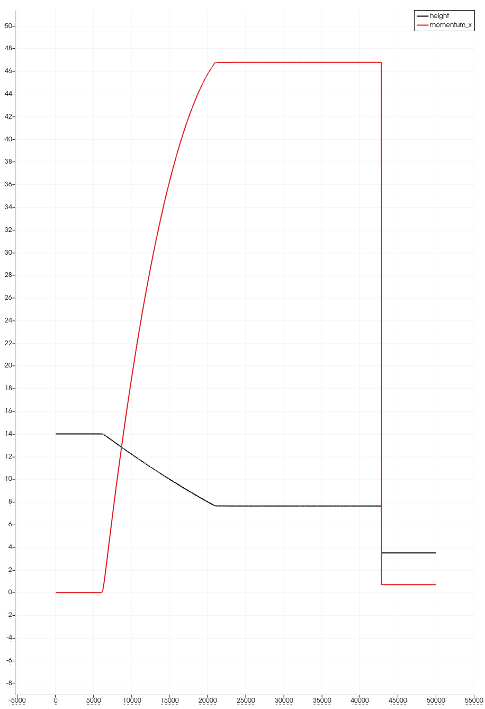

.. Tsunami documentation master file, created by
   sphinx-quickstart on Fri Apr 10 15:27:16 2026.
   You can adapt this file completely to your liking, but it should at least
   contain the root `toctree` directive.

.. toctree::
   :maxdepth: 2
   :caption: Contents:

   test

Tsunami documentation
=====================

Documentation
-------------

Link to our code: 
https://github.com/edwloef/tsunami_lab

Compile this project by typing scons in the terminal.
To run the tests, enter 

``./build/tests.exe``

In order to work with the GEBCO files and data, download the zip file 
and unzip it: 

``curl -Lo GEBCO_2026_sub_ice.zip https://dap.ceda.ac.uk/bodc/gebco/global/gebco_2026/sub_ice_topography_bathymetry/netcdf/GEBCO_2026_sub_ice.zip
unzip GEBCO_2026_sub_ice.zip``

To create the csv-file with the bathymetry data, run the prompt below in the terminal:

``gmt project -C141.024949/37.316569 -E146.0/37.316569 -G250e -Q | gmt grdtrack -GGEBCO_2026_sub_ice.nc | awk 'BEGIN {print "lon,lat,distance_m,elevation_m"} {print $1","$2","$3","$4}' > GEBCO_2026_sub_ice_bathy.csv``

To create the final csv-files where the actual simulation is shown,
type 

``./build/tsunami_lab <number_of_cells>``

in the terminal and let it run. 

You can then view the result with paraview.

Project Report 29.4.2026:
-------------------------

This week our task was the implementation of bathymetry and boundary conitions.

**1. FWave-solver with bathymetry**

First, we extended our FWave-solver to be able to work with bathymetry. 

(inlcude equations?)

Here is an example with the subcritical flow as demonstration:

.. video:: graphics/subcritical.mp4
   :width: 100%

**2. Reflecting Boundary Conditions**

Next was the reflecting boundary conditions. For this, we needed to adjust the height and the 
bathymetry of our current cell to that of the previous cell, and the particle velocity is the previous velocity as a negative.

(equation again?)

Here we can see that we obtain the one-sided solution of the shock-shock setup where we set q(left)
everywhere initially and use reflecting boundary conditions at the right boundary, and outflow boundary 
conditions at the left boundary.

.. video:: graphics/supercritical_reflect.mp4
   :autoplay:
   :width: 100%

**3. Hydraulic jumps**

THe following task concerned the implementation of a sub- and supercritical flow.
First we can see that the subcritical case works:

.. video:: graphics/subcritical.mp4
   :autoplay:
   :width: 100%

as well as the supercritical case:

.. video:: graphics/supercritical.mp4
   :autoplay:
   :width: 100%

First, we had to compute the location and value of the maximum Froude number for the subcritical setting
and the supercritical setting at the initial time t=0:

We can 

Project Report 22.4.2026:
-------------------------
* Edwin wrote the code to switch between the provided Roe solver and the f-wave solver.
* Edwin embedded our solver into GitHub Actions, and implemented the shock-shock and rare-rare problems as setups.
* Lara wrote the tests for the middle states and wrote the documentation.
* for 2.1.2:
* higher initial water height has no effect on the change in height due to the water streams meeting or parting
* higher particle velocity makes the change in water height larger
* for 2.2.2:
* a larger difference in height leads to a ripple in the wave at the dam position
* a higher particle velocity in the river leads to a wider and faster wave
* Our answer to the last question of evacuating the village: We would have 2248 seconds to do so, or 37 minutes.

Visualization:
--------------

Project Report 10.4.2026:
-------------------------

* Edwin wrote the code for the FWave solver. 
* Lara wrote the tests for the FWave solver and the documentation.

