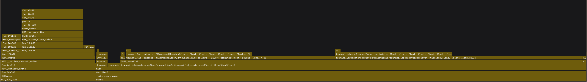

10. Individual Phase
--------------------

**1. Our Ideas and Goals**

For the individual phase, we thought about three prosibilities to improve the
speed of our program aka. the goals we want to achieve:

**Dynamic time-step size:** Our program currently derives a constant time-step 
size before entering the time loop. But this guess can be too large 
and especially toward the end of the simulation, it can be much smaller. We want to expirement
with deriving a maximal time for each time step in order to speed up later simulation stages
and avoid simulations where the result is useless due to an unlucky time-step guess.

**Subnormal FTZ/DAZ:** When we near the end of our simulation, the numbers get closer to zero and
can generate subnormal floating-point values, which can
lead to significant slowdowns. We would like to investigate whether hardware or
software FTZ/DAZ implementations can lead to measurable speedups in our
simulation in the presence of subnormal floating-point values, and check whether
such subnormal floating-point values occur often enough in practice for flushing to be
faster than just ignoring their presence.

**I/O Parallelization:** Only the wave propagation portions of our simulation are
parallelized. If we move output and checkpoint saving into their own thread each so
wave propagation can continue while they run, we may be able to significantly
increase CPU utilization, but at the cost of some memory
overhead. We would like to investigate how large of a speedup this could provide for
different simulation sizes and disk speeds.

Analyzing our program using VTune shows us this graph:

We can see that the large column on the left can be optimized by i.e.
moving it into the background, and therefore speeding up our code by 16%. 

**2. Milestones and Work Packages**

Milestone 1: Focus on I/O parallelization
- Work packages:

    - Asynchronous output i.e. create dedicated output thread and continue computation
    - Test with different simulations, measure runtime, 

Milestone 2: Focus on the dynamic time-step
- Work packages:

    - Compute maximum stable Δt each iteration
    - Replace fixed Δt with adaptive Δt
    - Verify correctness: check if simulation outputs are the same as before
    - Test on different sizes of simulations (number of time-steps, number of cells)

Milestone 3: Focus on FTZ/DAZ implementations
- Work packages:

    - Instrument the simulation i.e. add counters for subnormal values
    - Identify where they occur most frequently
    - Hardware implementation
    - Software flushing i.e. replace very small values with zero + configurable threshold
    - Measure runtime and compare numerical differences

**3. Time Schedule**

We plan a week for each milestone: 
In the first week (18.6. - 24.6.) we want to finish the I/O parallelization.

In the second week (25.6. - 1.7.) we want to implement the dynamic time step.

In the third week (2.7. - 8.7.) we want to investigate whether hardware or
software FTZ/DAZ implementations improve our code.
