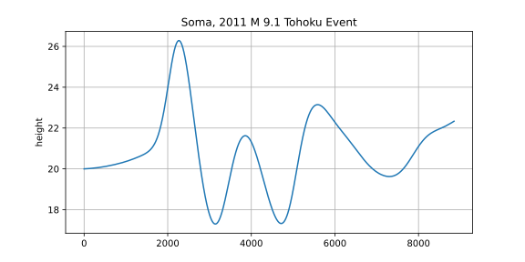

6. Tsunami Simulations
----------------------

**Project Report 27.5.2026:**

This week our task was to simulate two real tsunami events, one from March 11 in 2011, M 9.1 Tohoku
and the other from  February 27 in 2010, M 8.8 Chile.

**6.1. 2010 M 8.8 Chile Event**

Now to our simulations for the Chile event. We used the grid resolutions 250m, 500m, and 1000m.

The 250m simulation:

.. video:: graphics/chile_250m.mp4
    :width: 100%

The 500m simulation:

.. video:: graphics/chile_500m.mp4
    :width: 100%

The 1000m simulation:

.. video:: graphics/chile_1000m.mp4
    :width: 100%

**6.2. 2011 M 9.1 Tohoku Event**

Next we have the simulations of the Tohoku event. 

The 250m simulation:

.. video:: graphics/tohoku_250m.mp4
    :width: 100%

The 500m simulation:

.. video:: graphics/tohoku_500m.mp4
    :width: 100%

The 1000m simulation:

.. video:: graphics/tohoku_1000m.mp4
    :width: 100%

Now we will take a look at Sõma:

The x axis represents the timesteps of the simulation and the y axis the height of the water.

**Our contributions**

* Edwin simulated the two tsunami events and the Sõma simulation.
* Lara implemented the NetCDF tests and wrote the documentation.
