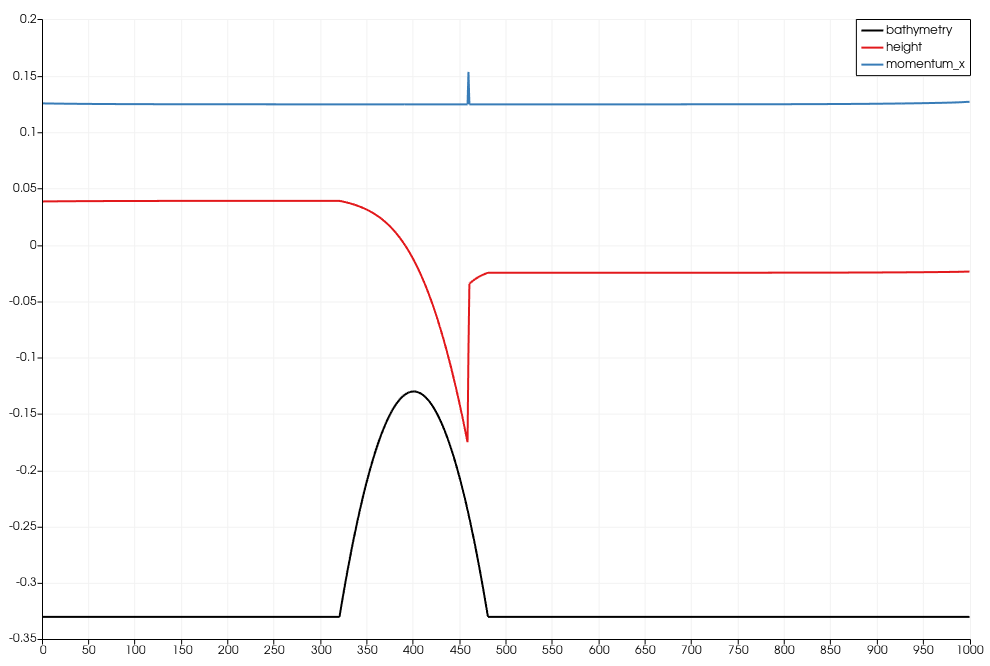

3. Bathymetry and Boundary Conditions
-------------------------------------

**Project Report 29.4.2026:**

This week our task was the implementation of bathymetry and boundary conitions.

**1. FWave-solver with bathymetry**

First, we extended our FWave-solver to be able to work with bathymetry. 
Here is an example with the subcritical flow as demonstration:

.. video:: graphics/subcritical.mp4
   :width: 100%

**2. Reflecting Boundary Conditions**

Next was the reflecting boundary conditions. For this, we needed to adjust the height and the 
bathymetry of our current cell to that of the previous cell, and the particle velocity is the previous velocity as a negative.

Here we can see that we obtain the one-sided solution of the shock-shock setup where we
use reflecting boundary conditions at the right boundary, and outflow boundary 
conditions at the left boundary.

.. video:: graphics/supercritical_reflect.mp4
   :width: 100%

**3. Hydraulic jumps**

The following task concerned the implementation of a sub- and supercritical flow.
First we can see that the subcritical case functions correctly:

.. video:: graphics/subcritical.mp4
   :width: 100%

as well as the supercritical case:

.. video:: graphics/supercritical.mp4
   :width: 100%

We also had to compute the location and value of the maximum Froude number for the subcritical setting
and the supercritical setting at the initial time t=0.

In our video our maximal bathymetry height is at :math:`x = 4000`.
We don't want to use 4000 in our calculations:

.. math::

    \frac{4000}{10000} = \frac{2}{5} = \frac{10}{25}

Now we transform our formula for the Froude number:

.. math::

    F = \frac{u}{\sqrt{gh}} = \frac{\frac{hu}{h}}{\sqrt{gh}}

First the subcritical calculation:
We only need to insert the correct numbers:

.. math::

    \frac{\frac{4.42}{1.8}}{\sqrt{9.81 \cdot 1.8}} \approx 0.584

Given that for a subcritical region, F needs to be lesser than one, this result is correct.
Now for the supercritical calculations:

.. math::

    \frac{\frac{hu}{h}}{\sqrt{gh}} = \frac{\frac{0.18}{0.13}}{\sqrt{9.81 \cdot 0.13}} \approx 1.226

Given that for a supercritical region, F needs to be bigger than one, this result is correct as well.

We can also see that our f-wave solver fails to converge to our expected constant momentum 
over the entire domain:

**4. 1D Tsunami Simulation**

First we extracted the bathymetry data for the 1D domain using a 250m sampling between the points p1=(141.024949,37.316569)
and p2=(146.0,37.316569).

Next we added the ability to read the extracted bathymetry data to our csv reader. 
Then we implemented the TsunamiEvent1d setup with our csv reader as well as the given data for our wave.

.. video:: graphics/tsunami.mp4
   :width: 100%